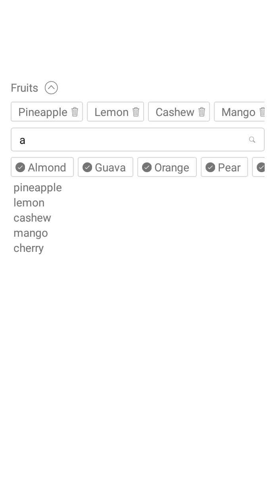
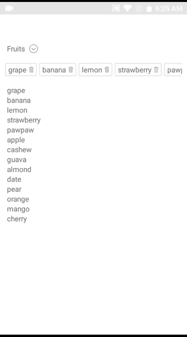
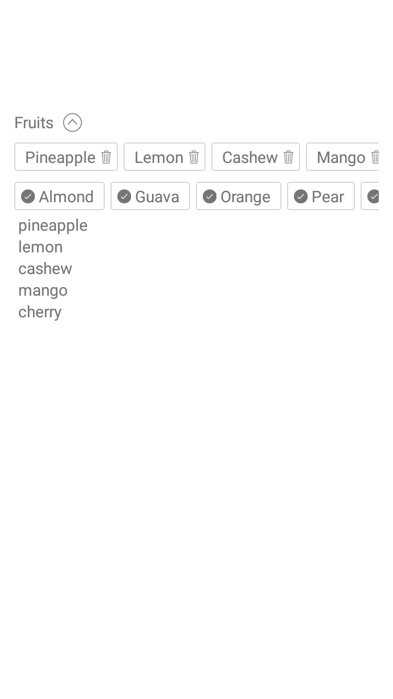

# react-native-multiple-tags
Multiple Select using Tags


# Demo
 
  
 
 


# Installation
```s
npm i -S react-native-multiple-tags
```

# Usage


```js

import React, { Component } from 'react';
import {
        View,
        Text,
} from 'react-native';
import MultipleTags from 'react-native-multiple-tags';


const tags = [
  'cherry',
  'mango',
  'cashew',
  'almond',
  'guava',
  'pineapple',
  'orange',
  'pear',
  'date',
  'strawberry',
  'pawpaw',
  'banana',
  'apple',
  'grape',
  'lemon',
];

const objectTags = [
  {
    key: 'id_01',
    value: 'cherry',
  },
  {
    key: 'id_02',
    value: 'mango',
  },
  {
    key: 'id_03',
    value: 'cashew',
  },
  {
    key: 'id_04',
    value: 'almond'
  },
  {
    key: 'id_05',
    value: 'guava'
  },
  {
    key: 'id_06',
    value: 'pineapple'
  },
  {
    key: 'id_07',
    value: 'orange'
  },
  {
    key: 'id_08',
    value: 'pear'
  },
  {
    key: 'id_09',
    value: 'date'
  }
]


class WelcomeComponent extends Component {
  constructor(props) {
    super(props);
    this.state = {
      content: [],
      contentx: [],
    };
  }

  render() {
    return (
      <View>
        <MultipleTags
            tags={objectTags}
            search
            onChangeItem={(content) => { this.setState({ content }); }}
            title="Fruits"
          />
          {
          (() => this.state.content.map(item => <Text key={item.key}> {item.key}: {item.value} </Text>))()
          }
        <MultipleTags
          tags={tags}
          search
          onChangeItem={(contentx) => { this.setState({ contentx }); }}
          title="Fruits"
        />
        {
        (() => this.state.contentx.map(item => <Text key={item}> {item} </Text>) )()
        }
      </View>
    );
  }
}

export default WelcomeComponent;     
```

## Props
---
| Prop        | Required   | Types | Purpose  |
| --- |---| ---|---|
| tags      | Yes | array | List of tags/items to display for selection. This can be array of objects or just an array of strings |
| preselectedTags      | No | array | List of tags/items to be selected on default. tags can be  array of objects or array of strings. |
| objectKeyIdentifier | No | string |  when using array of objects you can signify the key property of the object i.e objectTags = `[{ id: 'id_01', name: 'cherry' }]` and that becomes `objectKeyIdentifier = 'id'`  , default is key |
| objectValueIdentifier | No | string | when using array of objects you can signify the value property of the object i.e objectTags = `[{ id: 'id_01', name: 'cherry' }]` and that becomes `objectValueIdentifier = 'name'`,  default is value |
| search      | No      | boolean |  set search to false to hide the search bar. |
| onChangeItem | Yes      | function | JavaScript function passed in as an argument. This function is called whenever items are added or removed in the component. |
| title | No | string | The Name or Category of tags. |
| iconAddName | No | string | Name of icon to be used instead of the regular +, icon name must be of Ionicons in react-native-vector-icons |
| searchHitResponse | No | string | Text to display when search query hits nothing. |
| defaultInstructionClosed | No | string | Text to instruct users what to do when closed |
| defaultTotalRenderedTags | No | number | Total number of tags to show or render, default is 30
| defaultInstructionOpen | No | string | Text to instruct users what to do when opened |
| sizeIconTag | No | number |  Size Icon of add (plus) item. |
| showIconAdd | No | boolean | Set false if you want hide the Add Icon. |
| labelActiveTag | No | object | Custom style for active tag label. |
| tagActiveStyle | No | object |  Custom style for active tag. |
| visibleOnOpen | No | boolean | 


# Todo

- [x] Supports array of objects.


PR's are welcome
